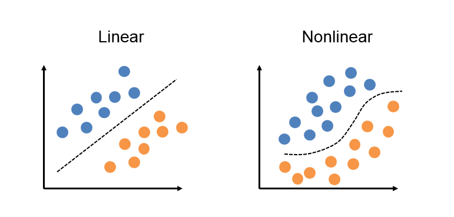

# Ponderada 6 - Módulo 8
## Emanuele Lacerda Morais Martins

## Como instalar e rodar o sistema criado

1. Clone este repositório:
```
git clone https://github.com/emanuelemorais/exercicios-mod8.git
```
2. Entre no diretório `exercicios-mod8/ponderada6`, crie uma venv e a ative:
```
python3 -m venv venv
source venv/bin/activate
```
3. Instale os requirements da aplicação:
```
pip install -r requirements.txt
```
4. No código, estão disponíveis algumas opções de saída para portas lógicas a serem testadas, incluindo AND, OR, NAND e XOR. A fim de avaliar o desempenho de cada porta lógica individualmente, é preciso descomentar (uma de cada vez) a variável "y", que representa os resultados esperados (linhas 32 a 42).

> Disclaimer: Antes de testar a porta lógica XOR leia a próxima sessão do README
```
# Resultados para AND
y = np.array([0, 0, 0, 1]) 

# Resultados para OR
# y = np.array([0, 1, 1, 1])  

# Resultado para NAND
# y = np.array([1, 1, 1, 0])

# Resultados para XOR
# y = np.array([0, 1, 1, 0]) 
```
5. Por fim, após escolher a porta lógica a ser testada, no mesmo diretório execute o seguinte comando
```
python3 perceptron.py
```

## Resultado inesperado (porta lógica XOR)

O perceptron, por sua natureza, está restrito a aprender exclusivamente funções linearmente separáveis. Portas lógicas como AND, OR e NAND representam problemas lineares, possibilitando que um perceptron de camada única reproduza eficientemente o comportamento dessas portas. No entanto, no caso da porta lógica XOR, sua saída possui um padrão que não pode ser distinguido por uma única linha, tornando inviável o funcionamento adequado com apenas um perceptron. Para capturar a complexidade da porta XOR, é necessário utilizar múltiplos perceptrons organizados em camadas, formando assim uma rede neural.



## Video do funcionamento completo

https://www.loom.com/share/3211ad82bfec41fba179969a7b9fd0df

Segue o [link](https://www.loom.com/share/3211ad82bfec41fba179969a7b9fd0df) do vídeo.
