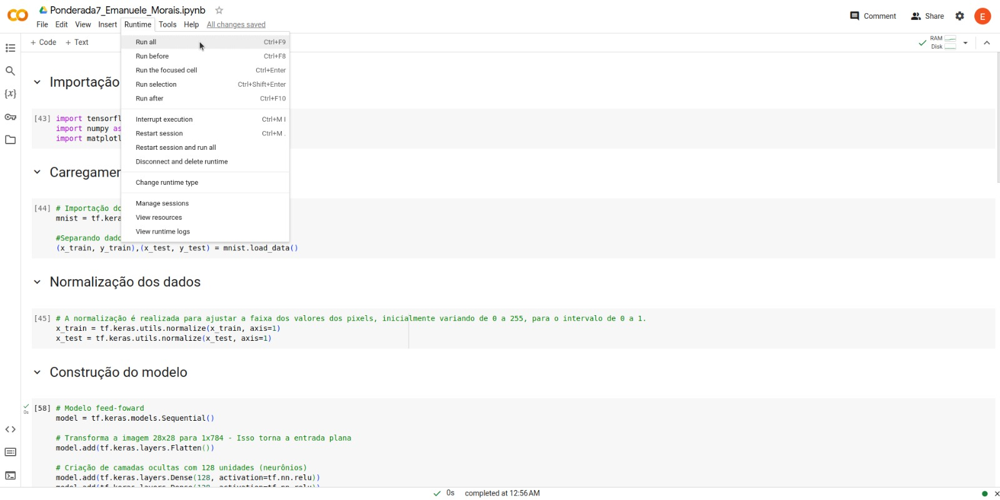

# Ponderada 7 - Módulo 8
## Emanuele Lacerda Morais Martins

## Como executar

Essa atividade foi feita usando o Google Colaboratory. Para acessá-lo é possível clicar no [link](https://colab.research.google.com/drive/1BcXrzS-bl-VA6YRoTgXf7F-l8S5vQ2AE?usp=sharing). Para executar as células de código clique em `Runtime` e depois em `Run all`.

Além disso o código fonte também de encontra no diretório `exercicios-mod8/ponderada7/Ponderada7_Emanuele_Morais.ipynb` deste repositório e pode ser executado localmente ao clonar o repositório.

## Video do funcionamento completo

https://www.loom.com/share/b9814a696701467a9ffbf672ebc443ae

Segue o [link](https://www.loom.com/share/b9814a696701467a9ffbf672ebc443ae) do vídeo.
