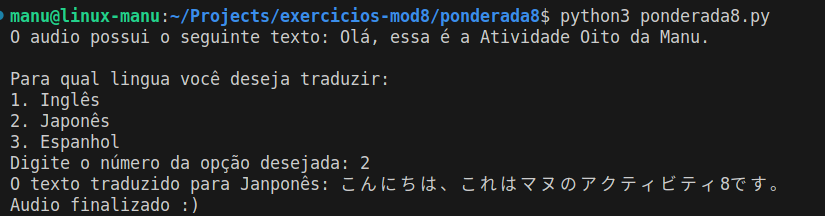

# Ponderada 8 - Módulo 8
## Emanuele Lacerda Morais Martins


## Como rodar

1. Clone este repositório:
```
git clone https://github.com/emanuelemorais/exercicios-mod8.git
```
2. Entre no diretório `exercicios-mod8/ponderada8`, crie uma venv e a ative:
```
python3 -m venv venv
source venv/bin/activate
```
3. Instale os requirements da aplicação:
```
pip install -r requirements.txt
```
4. Crie um arquivo .env e adicione uma chave de API da OpenAI:
```
OPENAI_API_KEY=<sua-chave-de-api>
```
4. Rode o arquivo `cria_audio.py` para criar ou editar o audio usado como base. Na linha 26 desse arquivo é possível trocar o texto do audio base.
```
python3 cria_audio.py
```
5. Rode o arquivo `ponderada8.py` para fazer o processo de transcrição, tradução e criação do audio na lingua traduzida.
```
python3 ponderada8.py
```
Na execução desse arquivo será possível escolher entre as linguas Inglês, Japonês e Espanhol para realizar a tradução.



## Video demonstrativo

Acesse o video no [link](https://youtu.be/HOCFSBjL2FQ?si=39KxT6_ETMNoHIvw)


